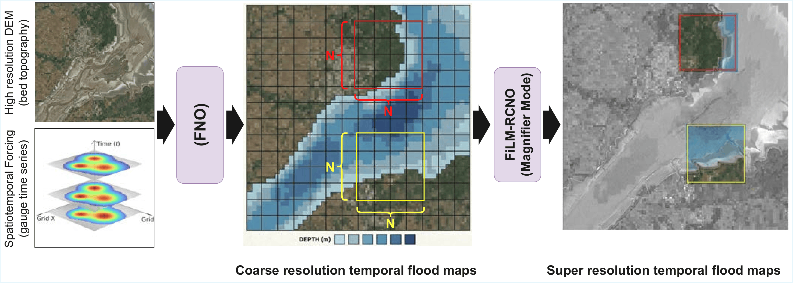
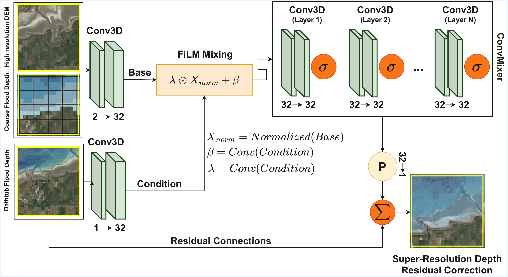
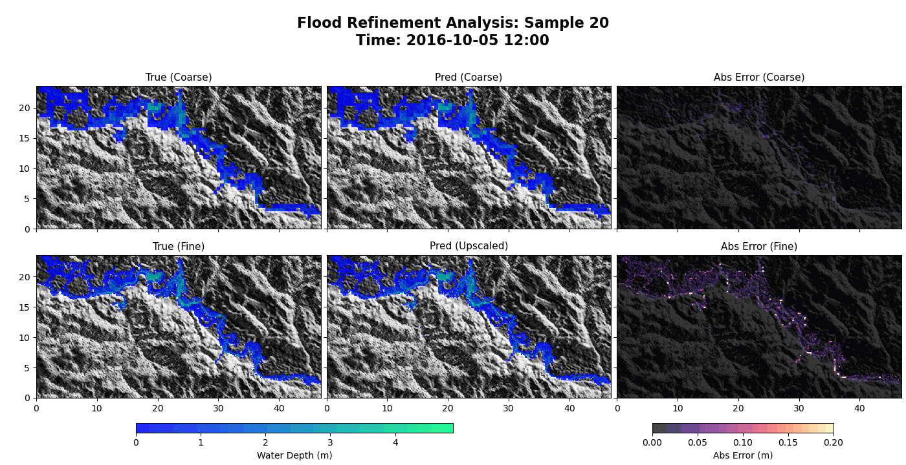

# Physically Anchored Multi-Resolution Neural Operator Framework for Flood Inundation Prediction

This repository contains the official implementation of the paper:

**"Physically Anchored Multi-Resolution Neural Operator Framework for Flood Inundation Prediction"**

The manuscript is currently under review in **Hydrology and Earth System Sciences (HESS)**.

---

## Overview

High-fidelity flood inundation modeling based on the 2D Shallow Water Equations (SWE) is essential for realistic hazard assessment, but conventional hydraulic solvers are often too expensive for real-time forecasting, large ensemble simulation, and uncertainty quantification. At the same time, simpler terrain-based inundation methods are fast but often fail to capture dynamic hydraulic behavior such as wave propagation, attenuation, spillover, and backfilling.

This repository implements a **physically anchored multi-resolution Scientific Machine Learning (SciML) framework** that aims to bridge this gap. The framework combines:

- a **global Fourier Neural Operator (FNO)** that learns large-scale flood-wave dynamics on a coarse grid, and
- a **local Neural Residual Magnifier** that reconstructs high-resolution inundation patterns using fine-scale topography and a physics-guided baseline.

The framework is designed to preserve large-domain hydraulic consistency while recovering fine-scale inundation structure at much lower computational cost than full hydrodynamic simulation.

---

## Framework Overview

<p align="center">
  
</p>

<p align="center">
  <strong>Figure 1:</strong> Overview of the multi-resolution flood inundation framework.
</p>

### Stage 1: Global Wave Propagation with FNO

The first stage uses a **Fourier Neural Operator (FNO)** to model the global evolution of flood dynamics on a coarse grid. By operating in the spectral domain, the FNO captures long-range spatial dependencies more efficiently than local convolution-based models.

Depending on the case study, the coarse model is conditioned on problem-specific forcing information such as boundary hydrographs or flood-driving inputs. Its output is a coarse-resolution spatiotemporal water-depth field that captures the large-scale flow envelope, arrival timing, and attenuation behavior across the domain.

### Stage 2: High-Resolution Refinement with the Magnifier

The second stage is a **Neural Residual Magnifier**, which refines the coarse prediction to a much finer spatial resolution. Rather than predicting the full high-resolution inundation map from scratch, the magnifier learns a **residual correction** on top of a physics-based initialization.

A key idea in this framework is the use of a **physics-anchored Bathtub Baseline**:

1. The coarse predicted depth is combined with coarse topography to estimate a coarse **water surface elevation (WSE)**.
2. This WSE is projected onto the fine-resolution DEM.
3. A terrain-respecting initial inundation field is reconstructed by filling the fine DEM up to the predicted WSE.

This baseline provides a physically plausible starting point, while the neural magnifier corrects the errors caused by static filling assumptions and missing dynamic effects.

---

## Magnifier Model Architecture

<p align="center">
  
</p>

<p align="center">
  <strong>Figure 2:</strong> Architecture of the FiLM-RCNO Magnifier model.
</p>

The magnifier operates on overlapping local patches for memory-efficient high-resolution inference. Each patch typically uses three main information channels:

- **Coarse flow prediction** from the global FNO
- **Fine-resolution topography** (DEM)
- **Bathtub baseline reconstruction**

The model is implemented as a residual convolutional refinement network with skip connections, allowing it to preserve terrain-controlled spatial details while correcting coarse-scale and hydrostatic errors.

In the paper formulation, the magnifier is designed to:

- improve inundation boundaries near topographic controls,
- recover fine-scale wet/dry transitions,
- reduce artifacts from simple geometric upscaling,
- and maintain consistency with physically meaningful water surface structure.

---

## Inference Strategy

To improve robustness and reduce patch-boundary artifacts, the inference pipeline includes the following design choices:

### 1. Overlapping patch prediction
The fine-resolution domain is processed patch by patch, which keeps GPU memory requirements manageable even for large floodplains.

### 2. Centered stitching
Only the central region of each predicted patch is retained when reassembling the global output. This reduces edge artifacts introduced by patchwise inference.

### 3. Test-time self-ensemble
At inference time, each patch can be evaluated under multiple orientations (rotations and flips), and the predictions are averaged. This helps reduce directional bias and stabilize wet/dry boundary predictions.

---

## Case Studies

The repository contains implementation and data handling logic for the following three real-world flood case studies:

1. **Neuse River**  
   A hurricane-driven fluvial flooding event along the Neuse River upstream of Quaker Neck Lake in North Carolina, USA.

2. **Fall River Lake Dam**  
   A dam-break overtopping failure scenario at Fall River Lake Dam in Kansas, USA.

3. **Chowilla Floodplain**  
   A long-duration regulated floodplain system in the Chowilla floodplain within the Murray–Darling Basin, South Australia.

These cases were selected to represent distinct flood-generation mechanisms and hydraulic behaviors, including riverine flooding, dam-failure-driven inundation, and regulated floodplain dynamics.

---

## Flooding Animation



*Animation: Hurricane-driven fluvial flooding event along the Neuse River.*

---

## What This Repository Includes

This codebase provides the core implementation needed to train and evaluate the proposed multi-resolution flood inundation framework, including:

- global neural operator models for coarse flood prediction,
- local magnifier models for high-resolution refinement,
- utilities for topography handling and physics-guided reconstruction,
- case-specific data loading pipelines,
- training and inference scripts,
- and supporting utilities for flood mapping experiments.

---

## Repository Structure

- `models/`  
  PyTorch implementations of the neural operator architectures, including the global model and the local magnifier modules.

- `lib/`  
  Shared utilities, helper functions, numerical components, interpolation logic, and supporting physical reconstruction tools.

- `FNO_forward/`  
  Case-specific data loaders, preprocessing logic, training scripts, and multi-stream parallel training workflows for forward prediction.

- `figs/`  
  Figures and visual assets used in the documentation.

---

## Core Modeling Idea

The main philosophy behind this repository is that flood inundation prediction benefits from **separating global dynamics from local spatial refinement**:

- The **global model** learns how the flood wave moves across the full domain.
- The **local model** learns how terrain, local relief, and fine spatial structure modify inundation at high resolution.
- A **physics-based baseline** ties both stages together and improves plausibility.

This makes the framework more physically grounded than purely image-to-image super-resolution approaches, while being much faster than running a full hydrodynamic solver for every scenario.

---

## Evaluation

The framework is designed to support evaluation using both continuous and inundation-specific binary metrics. Depending on the experiment and case study, typical metrics include:

- **Precision**
- **Recall**
- **F1-score**
- **Critical Success Index (CSI)**

These metrics are used to compare predicted inundation maps against high-fidelity hydraulic benchmarks.

---

## Intended Use

This repository is intended for researchers and practitioners working in:

- flood inundation modeling,
- scientific machine learning,
- surrogate modeling for hydraulic systems,
- uncertainty quantification,
- and real-time or ensemble-based flood forecasting.

---

## Citation

If you use this repository in your work, please cite the corresponding paper once it is published.

```bibtex
@article{placeholder2026floodno,
  title   = {Physically Anchored Multi-Resolution Neural Operator Framework for Flood Inundation Prediction},
  author  = {Authors},
  journal = {Hydrology and Earth System Sciences},
  year    = {2026},
  note    = {Under review}
}